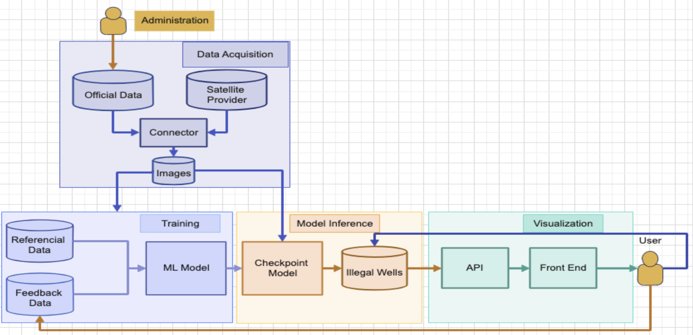
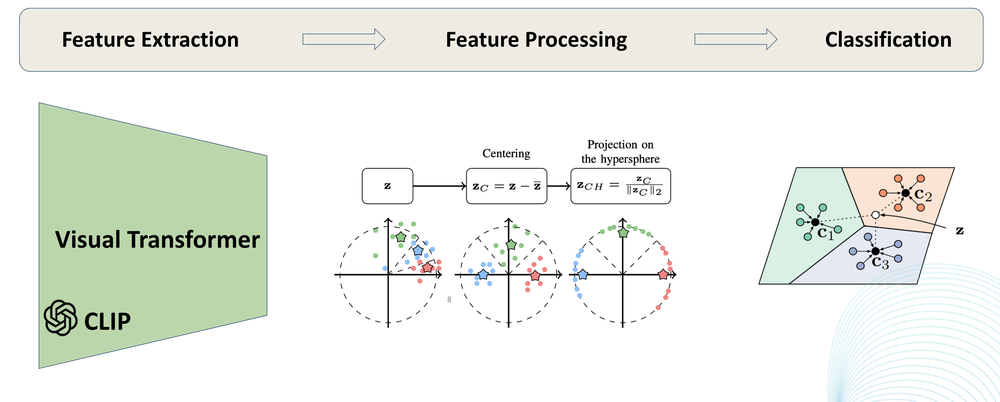
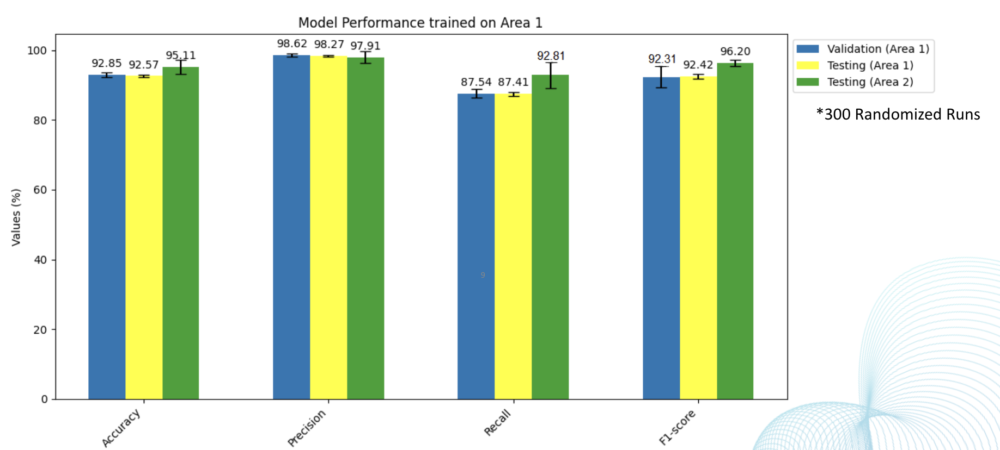

# Bir-radar

    

Water is becoming a rare resource across the world and more urgently in Morocco. Underground water in the south have been heavily drained out due to excessive usage. This has led the authorities to forbid well draining in many areas. Unfortunately, 90% of existing wells are unauthorized and representent a danger for the Moroccan water network. Although authorities try to regulate such activity, it is difficult to keep track of all existing wells in our kingdom. 

## Our Product

We propose an app for local authorities to keep track of unauthorized wells. Using satellite images and AI, we’re able to detect wells in rural regions. Our model cross-checks the detected wells with a database from authorities to raise an alert for illegal well drilling.

## Pipeline

    

- The official data is collected by authorities which contains information about official records of national farlmands (Registration ID, GPS Coords, Adress, Well Authorization, Owner).
- GPS coordinates of registred lands without a declared well are feeded to a connector. 
- The connector fetches images of the land using an API.
- These images are fed to a AI Model which predicts the existance of a well in the farm.
- This information is then updated on a database of unauthorized wells.
- The web interface uses this dataset to flag unauthorized wells and inform authorities.
- Finally, the user can validate the prediction of the model.
- The feedback of the user is fed to another dataset that will be used to retrain the AI model.

## Data

- First download the dataset of wells from the following [link](https://drive.google.com/drive/folders/1sNFrjZ1NvM4NovaG-5qYogH6wUkStW8Y?usp=drive_link).

## Web app
To run the web app, spawn the server:

    cd app
    ./odoo/odoo-bin -c /etc/odoo-server.conf

Then, in the browser, enter this URL 
http://localhost:8069/
replace localhost by the actual @IP of the host server if different than local machine.

## Model Training 
Running the model training and testing run on a certain seed
To train the model and test it on the same area:

    cd model
    python train.py --n-shots 10 --val-shots 10 --batch-size 128 --backbone clip_l14 --n-aug 1 --train-transforms "['clip_l14','centercrop']" --test-transforms "['clip_l14','resize_1.2','centercrop']" --dataset-path data/area1/ --device cuda:0 --seed $seed --log-metrics data/logs/

To train the model and test it on a different area, add the path of the test directory:

    cd model
    python train.py --n-shots 10 --val-shots 10 --batch-size 128 --backbone clip_l14 --n-aug 1 --train-transforms "['clip_l14','centercrop']" --test-transforms "['clip_l14','resize_1.2','centercrop']" --dataset-path data/area1/ --device cuda:0 --seed $seed --log-metrics data/logs/ --test-dataset-path data/area2

### About the model
We use the recent research in Few-shot Learning to adapt a large Foundation Model to our task [[1]](https://arxiv.org/abs/2103.00020)[[2]](https://arxiv.org/pdf/1911.04623.pdf).

#### Metrics
We report different metrics for our model. We have tested on different areas including robustness to unseen areas.

