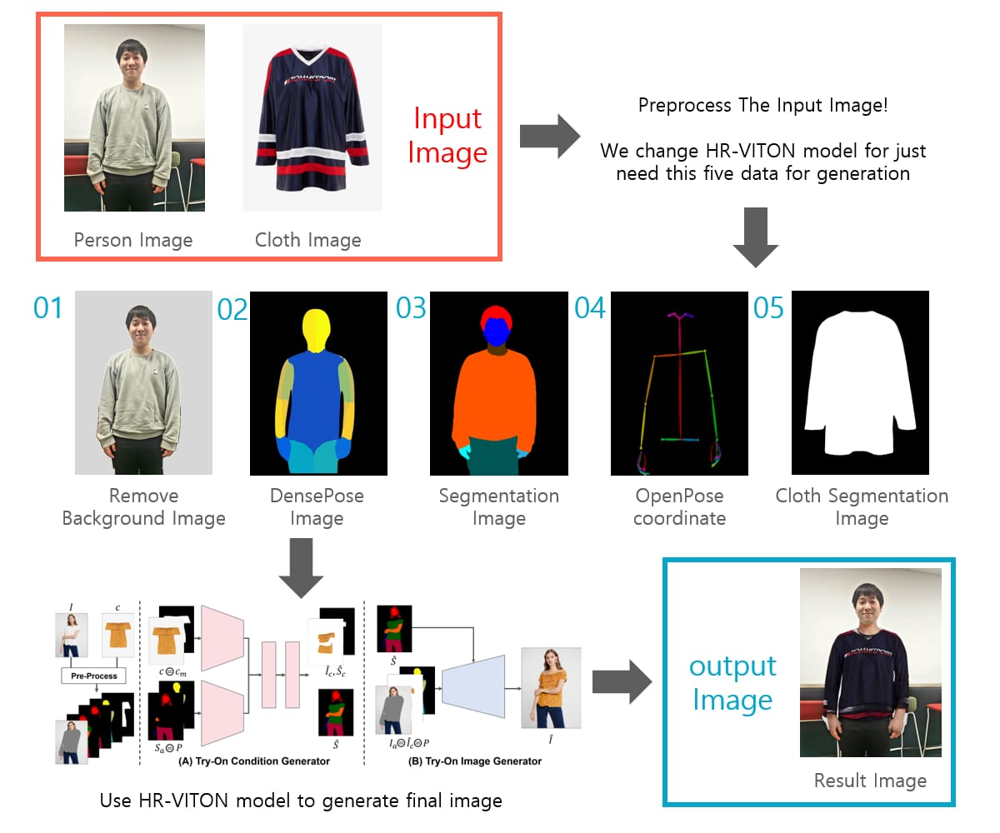
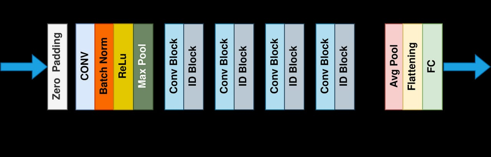

# `FITSYOU`

    

# `Problem statement`

In the rapidly evolving retail landscape, customers often face overwhelming choices when shopping for clothing items in physical stores. The absence of personalized recommendations tailored to individual preferences and fashion trends creates a significant challenge for customers in finding the right clothing items which leads to frustration, decreased customer satisfaction, and potential loss of sales for the store.
Moreover, store staff may struggle to provide effective recommendations due to limited knowledge of individual customer preferences and current fashion trends, as well as the large-scale store inventory in some cases. This results in missed opportunities to enhance the customer experience and foster brand loyalty.

# `Proposed solution`

`FITSYOU` is an on-site clothing solution that, based on client clothes that usually reflect his preferences, suggest the best clothes present in the store for him and gives him a virtual try-ons of the recommended clothes, this will improve client experience and encrease potential income for the clothing store:

### Here is a simple demo of our solution:

    

### Here is a basic pipeline of our solution:
 

    

### Here is a more detailled pipeline of our solution:

    

### more details about the virtual try-on multi model

    

### RESNET architecture

    

# `Deliverable`
The outcome of our project will be :
1. Python backend code:
   - Recommender system based on client appearence
   - Virtual try-on of the recommended clothes
2. a figma prototype of the project

# `Persepective`
In the future , we plane to enhance the quality of our solution by:
- Optimizing rendering time
- Gathering more data about what we suggested to the user and what he actually bought so that we can improve the performance of our recommendation system
- train the model on a custome data of a store including traditional clothing stores
- Tune the models   

