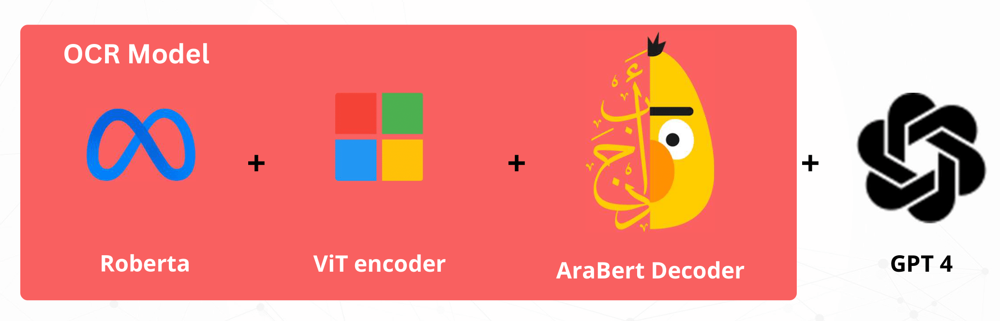
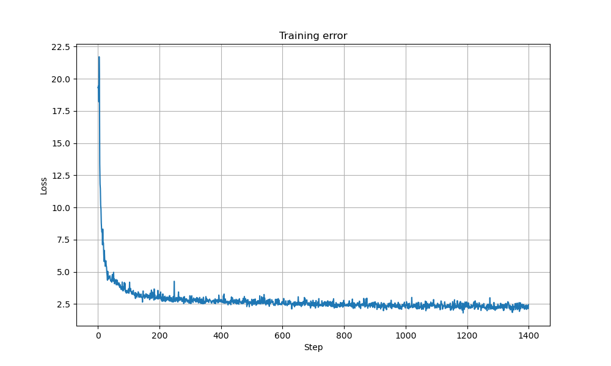
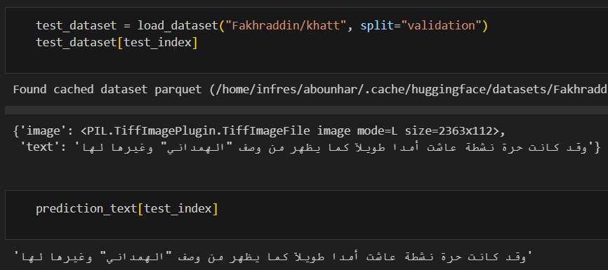

# Optical Character Recognition for Handwritten Arabic Characters using Vision Transformers, Arabert-V2 and RoBERTa 

## Abstract
This project implements an Optical Character Recognition (OCR) system for handwritten Arabic characters. For the encoder part, we used the [TrOCR](https://arxiv.org/abs/2109.10282) encoder which is a [Vision Transformer  (VIT)](https://arxiv.org/abs/2010.11929) that will extract the image features that will be later fed to the [AraBERT-V2](https://arxiv.org/abs/2003.00104) which is used in the decoder part to understand the textual context. As for the the tokenizer, it is based on [RoBERTa](https://arxiv.org/pdf/1907.11692.pdf). The model structure is summarized in the figure bellow:




The model was fine-tuned on the [Khatt](https://www.sciencedirect.com/science/article/abs/pii/S0031320313003300) dataset, a collection of handwritten Arabic text. Bellow the training loss curve:



An example of the output:



After the detection and transcription to the text phase, we can use the gathered information and ask a chatbot (based on GPT-4 here) to do summarization, entity recognition and many other tasks.

## Running the Project
1. First clone the main repository.
```bash
$ git clone https://github.com/MoroccoAI/AI-Summer-School.git
```
2.	Create a virtual environment (optional but recommended)
3.	Make sure to install the required packages:
```bash
$ pip install -r requirements.txt 
```
4.	Run the notebook for either training or testing

## Contribution
We welcome contributions to this project. If you find any issues or want to add new features, feel free to create a pull request.

## Contact
For any inquiries or collaborations, please reach out to us:
•	Abdelaziz BOUNHAR: bounhar.abdelaziz@gmail.com
•	Adnan ANOUZLA: adnan.anouzla@enim.ac.ma
•	Fatima Zahra QACHFAR : fqa.cyber@gmail.com
•	Ahmed JAAFARI : a.jaafari@aui.ma

## Project Materials
•	Link to Jupyter Notebooks
•	Presentation slides with recording preview of the app.

## Citations
```bibtex
@article{DBLP:journals/corr/abs-2109-10282,
  author       = {Minghao Li and
                  Tengchao Lv and
                  Lei Cui and
                  Yijuan Lu and
                  Dinei A. F. Flor{\^{e}}ncio and
                  Cha Zhang and
                  Zhoujun Li and
                  Furu Wei},
  title        = {TrOCR: Transformer-based Optical Character Recognition with Pre-trained
                  Models},
  journal      = {CoRR},
  volume       = {abs/2109.10282},
  year         = {2021},
  url          = {https://arxiv.org/abs/2109.10282},
  eprinttype    = {arXiv},
  eprint       = {2109.10282},
  timestamp    = {Sun, 02 Oct 2022 15:32:22 +0200},
  biburl       = {https://dblp.org/rec/journals/corr/abs-2109-10282.bib},
  bibsource    = {dblp computer science bibliography, https://dblp.org}
}
```
```bibtex
@article{DBLP:journals/corr/abs-2010-11929,
  author       = {Alexey Dosovitskiy and
                  Lucas Beyer and
                  Alexander Kolesnikov and
                  Dirk Weissenborn and
                  Xiaohua Zhai and
                  Thomas Unterthiner and
                  Mostafa Dehghani and
                  Matthias Minderer and
                  Georg Heigold and
                  Sylvain Gelly and
                  Jakob Uszkoreit and
                  Neil Houlsby},
  title        = {An Image is Worth 16x16 Words: Transformers for Image Recognition
                  at Scale},
  journal      = {CoRR},
  volume       = {abs/2010.11929},
  year         = {2020},
  url          = {https://arxiv.org/abs/2010.11929},
  eprinttype    = {arXiv},
  eprint       = {2010.11929},
  timestamp    = {Fri, 20 Nov 2020 14:04:05 +0100},
  biburl       = {https://dblp.org/rec/journals/corr/abs-2010-11929.bib},
  bibsource    = {dblp computer science bibliography, https://dblp.org}
}
```
```bibtex
@misc{antoun2021arabert,
      title={AraBERT: Transformer-based Model for Arabic Language Understanding}, 
      author={Wissam Antoun and Fady Baly and Hazem Hajj},
      year={2021},
      eprint={2003.00104},
      archivePrefix={arXiv},
      primaryClass={cs.CL}
}
```
```bibtex
@article{DBLP:journals/corr/abs-1907-11692,
  author       = {Yinhan Liu and
                  Myle Ott and
                  Naman Goyal and
                  Jingfei Du and
                  Mandar Joshi and
                  Danqi Chen and
                  Omer Levy and
                  Mike Lewis and
                  Luke Zettlemoyer and
                  Veselin Stoyanov},
  title        = {RoBERTa: {A} Robustly Optimized {BERT} Pretraining Approach},
  journal      = {CoRR},
  volume       = {abs/1907.11692},
  year         = {2019},
  url          = {http://arxiv.org/abs/1907.11692},
  eprinttype    = {arXiv},
  eprint       = {1907.11692},
  timestamp    = {Thu, 01 Aug 2019 08:59:33 +0200},
  biburl       = {https://dblp.org/rec/journals/corr/abs-1907-11692.bib},
  bibsource    = {dblp computer science bibliography, https://dblp.org}
}
```
```bibtex
@article{MAHMOUD20141096,

title = {KHATT: An open Arabic offline handwritten text database},

journal = {Pattern Recognition},

volume = {47},

number = {3},

pages = {1096-1112},

year = {2014},

note = {Handwriting Recognition and other PR Applications},

issn = {0031-3203},

doi = {https://doi.org/10.1016/j.patcog.2013.08.009},

url = {https://www.sciencedirect.com/science/article/pii/S0031320313003300},

author = {Sabri A. Mahmoud and Irfan Ahmad and Wasfi G. Al-Khatib and Mohammad Alshayeb and Mohammad {Tanvir Parvez} and Volker Märgner and Gernot A. Fink},

keywords = {Arabic handwritten text database, Arabic OCR, Document , },

}
``` 
